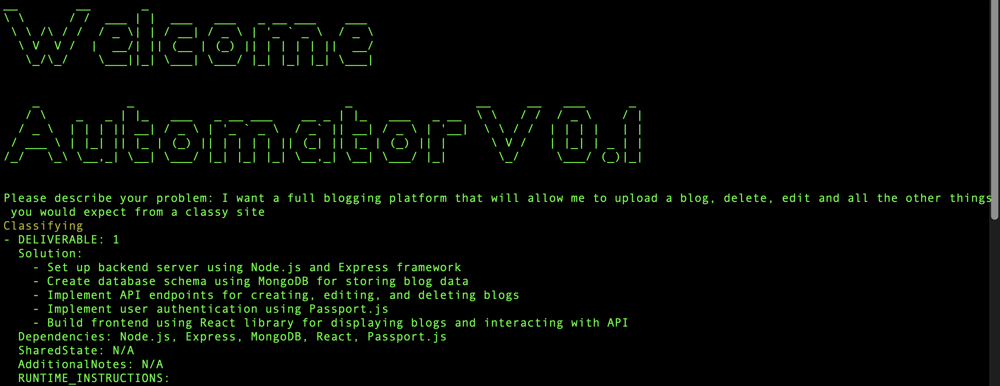

# Automator V 0.1


Automator V 0.1 is a Python-based project that uses OpenAI's GPT-3.5-turbo model to help decompose software development problems into smaller deliverables and generate code for the specified deliverables.

*contact Adam McMurchie to report issues or post them here*


## What can I do?

  


- Create me pong in pygame
- Create me a blogging platform
- Create me a website scraper

# What it does

1. Takes your command
2. Creates all the resources you need in the `output` folder

**NOTE** You need to do the cleanup of your outputs for now.

## Prerequisites

Before you begin, ensure you have met the following requirements:

* You have a working Python 3.6+ environment.
* You have an OpenAI API key to access the GPT-3.5-turbo model.

## Installation

To set up the project, follow these steps:

1. Clone the repository.

```bash
git clone https://github.com/your-username/automator-v0.1.git
cd automator-v0.1
```

2. Install the required Python packages.

```bash
pip install -r requirements.txt
``` 


3. Add your OpenAI API key.

```bash
export OPENAI_API_KEY="your-openai-api-key"
```

Or you can create a .TOKEN.txt file in the root directory of the project and add your OpenAI API key.

```bash
echo "your-openai-api-key" > .TOKEN.txt
```

## Usage

Run the main script to start the application:

```bash
python main.py
```


Follow the prompts to describe your problem, and the application will classify the problem, decompose it into smaller deliverables, and generate code for each deliverable.

The work will be in the output folder

## Limitations

This is still a work in progress so use it at your own discretion, items to add are:

1. Recursive debugging
2. Better sub componentisation
3. Consistent sub componentisation
4. Logging
5. Automated archiving of output folder


## Future work 


*Modularize the code*: Separate the code into multiple Python modules based on functionality. For example, create a separate module for interacting with the OpenAI API, another for parsing YAML files, and another for handling user input and main program flow.

*Use configuration files*: Instead of hardcoding the API key and other settings in the code, use a configuration file (e.g., JSON, YAML, or INI) to store these settings. This will make it easier to manage and update the configuration without modifying the code.

*Add error handling and validation*: Improve error handling and validation throughout the code. For example, validate user input, check for the existence of required files, and handle exceptions that might be raised when interacting with external services (e.g., OpenAI API).

*Add logging*: Implement a proper logging system to capture important events, warnings, and errors during the execution of the application. This will make it easier to troubleshoot and understand the program flow.

*Improve user interface*: Enhance the user interface by using a more user-friendly library like prompt_toolkit or even building a web interface for a better user experience.

*Add unit tests*: Write unit tests for different modules and functions to ensure the reliability and correctness of the code. This will help you catch bugs and regressions before they reach production.

*Add documentation*: Add docstrings to functions and classes to provide more information about their purpose and usage. This will make the code easier to understand and maintain.

*Use environment variables for sensitive information*: Instead of storing the OpenAI API key in a file, use environment variables to store sensitive information like API keys. This will make it easier to manage secrets and improve security.

*Use a package manager*: Utilize a package manager like pipenv or poetry to manage dependencies and virtual environments, making it easier for others to set up and use the project.

*Implement a progress indicator*: When generating code or interacting with external services like the OpenAI API, display a progress indicator to give the user feedback on the progress of the operation. This can be a simple spinner or a more advanced progress bar.


## Contributing

Pull requests are welcome. For major changes, please open an issue first to discuss what you would like to change.

## License

[MIT](https://choosealicense.com/licenses/mit/)
